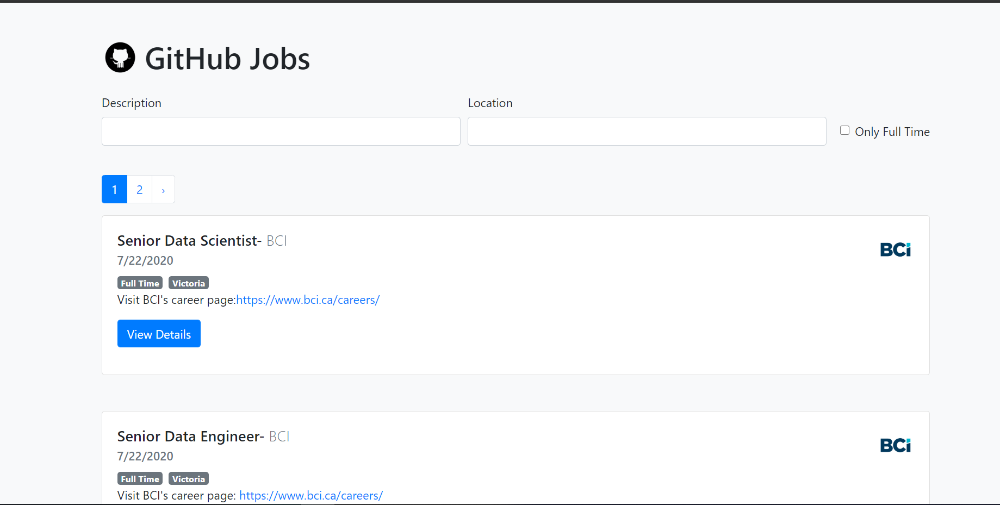

This GitHub Jobs Finder app displays 50 jobs in 1 go. 
You can also find yourself a suitable job with the filters of description and location.

** API **: Github-Jobs API
** Axios **: npm package used to fetch elements from API

## Preview

DropDown of Details.

Search though description, location and the type of job.

## Available Scripts

In the project directory, you can run:

### `npm start`

Runs the app in the development mode. 
Open [http://localhost:3000](http://localhost:3000) to view it in the browser.

The page will reload if you make edits. 
You will also see any lint errors in the console.

# Deployed on Firebase:

(https://github-jobs-005.web.app/)
